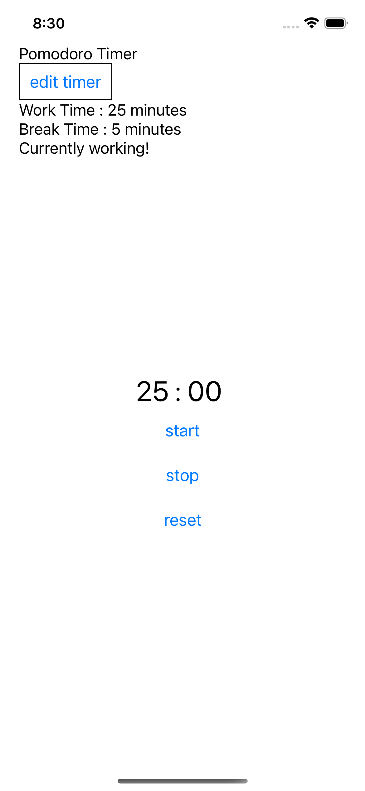
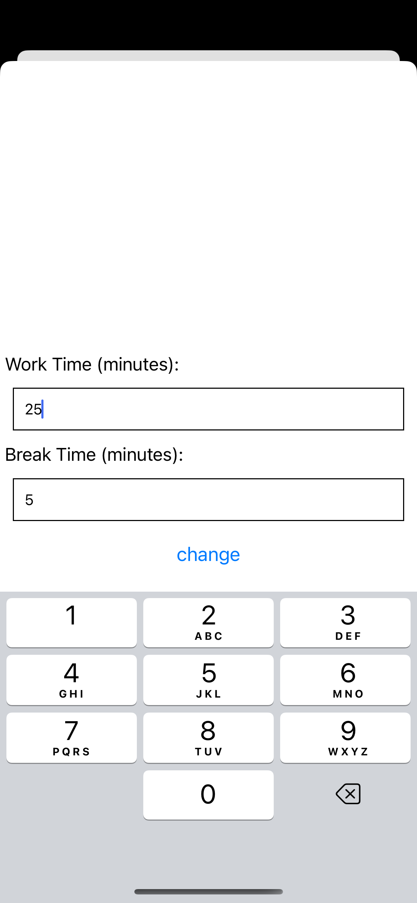
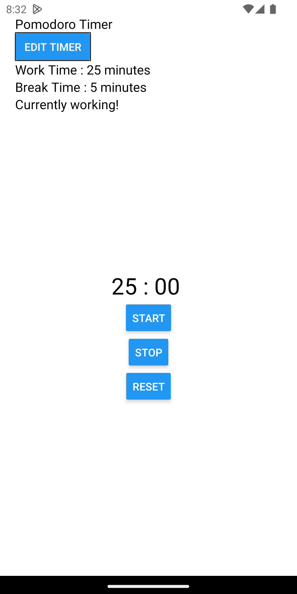
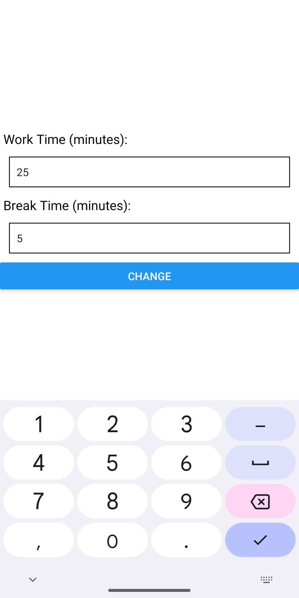

# Pomodoro Timer

Pomodoro timer that will help
people trying to use the [Pomodoro Technique](https://en.wikipedia.org/wiki/Pomodoro_Technique).
It will vibrate to tell you when to take breaks or resume working, based on some
determined values.

## Features

- Timer display minutes and seconds in text
- Timer count down seconds until it reaches 00:00
- Phone buzz when timer reaches 0
- Timers switch between 25 and 5 minutes
- Timer can be able to start, stop, and reset
- Allow the user to input any arbitrary time for the timers (e.g. 5 mins of work time and 5 mins of break)

Demo : [Expo Snacks link](https://snack.expo.dev/@kaungnyuntsan1/pomodoro-timer)

| iOS                                   | iOS                                   |
| ------------------------------------- | ------------------------------------- |
|  |  |

 

| Android                                       | Android                                       |
| --------------------------------------------- | --------------------------------------------- |
|  |  |
